# GPU-Optimized Object Tracking System

A comprehensive multi-modal object tracking system with ESP32 integration, featuring person detection, mobile phone detection, face detection, eye state monitoring, and gaze direction tracking.

## 🔄 Project Evolution

This project has evolved from a monolithic architecture to a professional modular structure:

- **🏗️ Original Code**: `main_Esp32.py` - Complete functionality in a single file (~1400+ lines)
- **🚀 Current Version**: `main.py` + modular `src/` structure - Professional, maintainable architecture

### Key Differences: main_Esp32.py vs main.py

| Aspect | main_Esp32.py (Legacy) | main.py (Current) |
|--------|------------------------|-------------------|
| **Architecture** | Monolithic single file | Modular multi-file structure |
| **Lines of Code** | 1400+ lines | ~100 lines (entry point) |
| **Maintainability** | Difficult to maintain/extend | Easy to maintain and extend |
| **Testing** | Hard to unit test | Comprehensive test coverage |
| **Code Organization** | All classes in one file | Separated by functionality |
| **Configuration** | Hardcoded values | JSON-based configuration |
| **Error Handling** | Basic error handling | Robust error management |
| **Documentation** | Minimal documentation | Complete API documentation |

### Migration Benefits

✅ **Improved Code Quality**: Separation of concerns and clean architecture  
✅ **Better Testing**: Individual modules can be tested independently  
✅ **Enhanced Maintainability**: Easy to modify specific functionality  
✅ **Professional Structure**: Industry-standard project organization  
✅ **Scalability**: Easy to add new features and detectors  

> 💡 **Recommendation**: Use `main.py` for new development. `main_Esp32.py` is kept for reference and compatibility.

## 🚀 Features

- **📱 Phone Detection**: YOLO11x-based mobile phone detection
- **👤 Person Detection**: Person confirmation with time-based validation
- **👁️ Eye Monitoring**: MediaPipe-based eye state detection and drowsiness alerts
- **👀 Gaze Tracking**: Real-time gaze direction monitoring with distraction alerts
- **🧠 Feature Extraction**: HRNetV2-based deep feature extraction for tracking
- **⚡ GPU Acceleration**: Full CUDA optimization for real-time performance
- **📡 ESP32 Integration**: Hardware alerts via HTTP communication
- **🔊 TTS Alerts**: Intelligent text-to-speech feedback system
- **🏗️ Modular Architecture**: Professional, maintainable code structure

## 📁 Project Structure

```
object-tracking/
├── main.py                     # Main entry point
├── src/                        # Source code modules
│   ├── core/                   # Core system components
│   │   ├── gpu_manager.py      # GPU management and optimization
│   │   └── config_manager.py   # Configuration management
│   ├── detection/              # Detection modules
│   │   ├── phone_detector.py   # Phone detection with YOLO
│   │   ├── face_detector.py    # Face detection with YOLO
│   │   ├── person_detector.py  # Person detection and confirmation
│   │   └── eye_gaze_detector.py # Eye state and gaze tracking
│   ├── tracking/               # Tracking and feature extraction
│   │   ├── object_tracker.py   # Multi-object tracking
│   │   └── feature_extractor.py # HRNetV2 feature extraction
│   ├── communication/          # Communication modules
│   │   ├── esp32_communicator.py # ESP32 communication
│   │   └── tts_manager.py      # Text-to-speech management
│   └── main_tracker.py         # Main tracker integration
├── models/                     # AI model files
├── config/                     # Configuration files
├── data/                       # Data files and outputs
├── arduino/                    # ESP32/Arduino code
├── docs/                       # Documentation
├── tests/                      # Unit tests
└── utils/                      # Utility scripts
```

## 🏗️ System Architecture

The following flowchart illustrates the complete system architecture and processing flow:

```mermaid
---
config:
      theme: redux
---
flowchart TD
    %% Entry Points
    A(["🚀 Start Application"])
    A --> B{"Select Entry Point"}
    B --> C["main.py<br/>(Modular)"]
    B --> D["main_Esp32.py<br/>(Legacy)"]
    
    %% Main Application Flow
    C --> E["📋 Load Configuration"]
    E --> F{"Config Source?"}
    F --> G["default_config.json"]
    F --> H["production_config.json"]
    F --> I["Built-in Defaults"]
    
    %% Configuration Loading
    G --> J["🔧 ConfigManager"]
    H --> J
    I --> J
    J --> K["🖥️ GPU Manager"]
    
    %% Hardware Initialization
    K --> L{"CUDA Available?"}
    L -->|Yes| M["✅ GPU Mode<br/>RTX Series"]
    L -->|No| N["⚠️ CPU Mode"]
    
    %% Model Loading
    M --> O["📦 Load Models"]
    N --> O
    O --> P["YOLO11x<br/>Phone Detection"]
    O --> Q["YOLOv11l<br/>Face Detection"]
    O --> R["HRNetV2<br/>Feature Extraction"]
    
    %% Detection Modules
    P --> S["📱 PhoneDetector"]
    Q --> T["👤 FaceDetector"]
    R --> U["🔍 FeatureExtractor"]
    O --> V["👥 PersonDetector"]
    
    %% Core Processing
    S --> W["🎯 Main Processing Loop"]
    T --> W
    U --> W
    V --> W
    
    %% Processing Pipeline
    W --> X["📹 Camera Input"]
    X --> Y["🖼️ Frame Preprocessing"]
    Y --> Z["👥 Person Detection"]
    
    %% Detection Flow
    Z --> AA{"Person Detected?"}
    AA -->|No| AB["⏸️ Skip Other Detection"]
    AA -->|Yes| AC["📱 Phone Detection"]
    
    AB --> AD["🔄 Next Frame"]
    AC --> AE["👤 Face Detection"]
    AE --> AF["👁️ Eye/Gaze Tracking"]
    
    %% Tracking System
    AF --> AG["📊 ObjectTracker"]
    AG --> AH["🔗 Feature Matching"]
    AH --> AI["📍 Position Tracking"]
    AI --> AJ["🎯 ID Assignment"]
    
    %% Decision Making
    AJ --> AK{"Detection Results?"}
    AK -->|Phone Found| AL["🚨 Phone Alert"]
    AK -->|Eyes Closed| AM["😴 Drowsiness Alert"]
    AK -->|Gaze Away| AN["👀 Distraction Alert"]
    AK -->|Normal| AO["✅ All Clear"]
    
    %% Alert System
    AL --> AP["🔊 TTS Manager"]
    AM --> AP
    AN --> AP
    AP --> AQ["📡 ESP32 Communicator"]
    
    %% ESP32 Communication
    AQ --> AR{"ESP32 Available?"}
    AR -->|Yes| AS["✅ Send Hardware Alert"]
    AR -->|No| AT["⚠️ Log Only"]
    
    %% Output and Visualization
    AS --> AU["🎨 Draw Visualizations"]
    AT --> AU
    AO --> AU
    AU --> AV["📺 Display Frame"]
    AV --> AW{"Continue?"}
    
    %% Loop Control
    AW -->|Yes| AD
    AW -->|No| AX(["🛑 Stop Application"])
    
    %% Styling
    classDef startEnd fill:#e1f5fe,stroke:#01579b,stroke-width:3px
    classDef process fill:#f3e5f5,stroke:#4a148c,stroke-width:2px
    classDef decision fill:#fff3e0,stroke:#e65100,stroke-width:2px
    classDef alert fill:#ffebee,stroke:#b71c1c,stroke-width:2px
    classDef config fill:#e8f5e8,stroke:#1b5e20,stroke-width:2px
    classDef module fill:#e3f2fd,stroke:#0d47a1,stroke-width:2px
    
    class A,AX startEnd
    class E,J,K,O,W,Y,AG,AP,AU process
    class B,F,L,AA,AK,AR,AW decision
    class AL,AM,AN,AS alert
    class G,H,I config
    class S,T,U,V,P,Q,R module
```



### 🔄 Processing Flow Overview

1. **🚀 Initialization**: Load configuration and initialize GPU resources
2. **📦 Model Loading**: Load YOLO and HRNetV2 models with CUDA optimization
3. **👥 Person Validation**: Confirm person presence before other detections
4. **🔍 Multi-Modal Detection**: Parallel phone, face, and gaze detection
5. **📊 Object Tracking**: Feature matching and ID assignment across frames
6. **🚨 Smart Alerts**: Context-aware TTS and ESP32 hardware notifications
7. **🎨 Real-time Visualization**: Live display with tracking overlays

> 📋 **Note**: For a more detailed system architecture diagram, see [SYSTEM_FLOWCHART.md](docs/SYSTEM_FLOWCHART.md)

## 🛠️ Installation

### Prerequisites

- Python 3.8+
- CUDA-capable GPU (recommended)
- Webcam or video files for input

### Required Dependencies

```bash
# PyTorch with CUDA support
pip install torch torchvision torchaudio --index-url https://download.pytorch.org/whl/cu118

# Core ML libraries
pip install ultralytics opencv-python mediapipe

# Communication and TTS
pip install pyttsx3 requests

# Additional utilities
pip install numpy pillow
```

### Model Files

This project requires 3 pre-trained models that are available in the **Releases** section under "models":

1. **yolo11x.pt** - YOLO11x model for phone detection
2. **yolov11l-face.pt** - YOLOv11 face detection model  
3. **hrnetv2_w32_imagenet_pretrained.pth** - HRNetV2 feature extraction model

#### 📥 Download Instructions

1. **Download Models**: Go to the [Releases](../../releases) section and download all 3 model files from the latest release under "models"
2. **Model Placement**:
   
   **For Modular Version (`main.py`)**:
   ```
   📁 object-tracking/
   └── models/
       ├── yolo11x.pt
       ├── yolov11l-face.pt
       └── hrnetv2_w32_imagenet_pretrained.pth
   ```
   
   **For Legacy Version (`main_Esp32.py`)**:
   ```
   📁 object-tracking/
   ├── main_Esp32.py
   ├── yolo11x.pt
   ├── yolov11l-face.pt
   └── hrnetv2_w32_imagenet_pretrained.pth
   ```

> ⚠️ **Important**: Model placement differs between versions:
> - **`main.py`**: Place models in the `models/` folder
> - **`main_Esp32.py`**: Place models in the same directory as the script

## 🚀 Usage

### Recommended Usage (Modular Architecture)

```bash
python main.py
```

### Legacy Usage (Original Monolithic Code)

```bash
python main_Esp32.py
```

> ⚠️ **Important**: For new users and development, always use `main.py`. The modular architecture provides better performance, maintainability, and features.

---

## 🚨 **QUICK START - If You're Confused About File Structure**

### **Can't understand the modular structure? No problem!**

> 🔴 **SIMPLE SOLUTION**: Just run the original single-file version:
> 
> ```bash
> python main_Esp32.py
> ```
> 
> **This file contains ALL functionality in one place** - no complex folder structure, no imports to worry about, just run and go! 
> 
> ✅ **Same features**: Phone detection, face detection, eye tracking, gaze monitoring  
> ✅ **Same performance**: Full GPU acceleration and real-time processing  
> ✅ **Same alerts**: TTS notifications and ESP32 integration  
> ✅ **No setup complexity**: Everything works out of the box  

---

### Functional Differences

**main.py (Recommended)**:
- ✅ Modular architecture with separated components
- ✅ JSON-based configuration management  
- ✅ Professional error handling and logging
- ✅ Comprehensive test coverage
- ✅ Easy to extend and maintain
- ✅ Better GPU memory management
- ✅ Configurable detection thresholds

**main_Esp32.py (Legacy)**:
- ⚠️ All functionality in single file
- ⚠️ Hardcoded configuration values
- ⚠️ Basic error handling
- ⚠️ Difficult to test individual components
- ⚠️ Limited configurability

### Runtime Controls

| Key | Function |
|-----|----------|
| `q` | Quit application |
| `f` | Toggle face gaze detection |
| `e` | Toggle eye detection |
| `g` | Show GPU statistics |
| `+/-` | Adjust eye threshold |
| `r` | Reset all detection states |
| `c` | Clear GPU cache |
| `t/y` | Adjust gaze timing threshold |
| `u/i` | Adjust gaze sensitivity |
| `p` | Show gaze debug info |
| `s` | Save current configuration |

## ⚙️ Configuration

The system uses JSON configuration files located in `config/`. Key parameters include:

### ESP32 Configuration
```json
{
  "esp32": {
    "ip": "10.27.146.54",
    "port": 80,
    "alert_cooldown": 2.0
  }
}
```

### Detection Thresholds
```json
{
  "thresholds": {
    "person_confidence": 0.5,
    "phone_confidence": 0.3,
    "face_confidence": 0.4,
    "eye_closed_threshold": 0.25,
    "gaze_threshold": 0.02
  }
}
```

### Timing Parameters
```json
{
  "timing": {
    "consecutive_time_required": 3.0,
    "gaze_distraction_threshold": 3.0,
    "eye_tts_cooldown": 4,
    "gaze_tts_cooldown": 3,
    "phone_tts_cooldown": 5
  }
}
```

## 📡 ESP32 Integration

> ⚠️ **Note**: ESP32 integration is currently under construction. Hardware alert functionality is being developed and may not be fully operational.

The system is designed to communicate with an ESP32 device for hardware alerts:

### Planned API Endpoints
- `/phone_alert` - Trigger phone detection alert
- `/drowsiness_alert` - Trigger drowsiness alert
- `/distraction_alert` - Trigger gaze distraction alert
- `/stop_alert` - Stop current alert
- `/status` - Get device status

### ESP32 Setup (Under Development)
1. Flash the Arduino code from `arduino/smoke_detector/`
2. Configure your ESP32's IP address in the config
3. Ensure the ESP32 is connected to the same network

**Current Status**: The system gracefully handles ESP32 connection failures and will fall back to TTS-only alerts when hardware is not available.

## 🎯 Detection Workflow

1. **Person Detection**: System first confirms a person is present for 3+ seconds
2. **Multi-Modal Detection**: Once confirmed, runs parallel detection for:
   - Mobile phones (YOLO11x)
   - Faces (YOLOv11l)
   - Eye state (MediaPipe)
   - Gaze direction (MediaPipe)
3. **Object Tracking**: Tracks detected objects across frames using feature matching
4. **Alert Generation**: Triggers TTS and ESP32 alerts based on detection states

## 🔧 Performance Optimization

### GPU Optimization
- CUDA memory management
- Mixed precision inference
- Batch processing for feature extraction
- GPU-accelerated image preprocessing

### Real-time Performance
- Optimized for 30+ FPS on modern GPUs
- Configurable detection thresholds
- Efficient object tracking algorithms
- Smart alert cooldown mechanisms

## 🐛 Troubleshooting

### Common Issues

1. **CUDA Out of Memory**
   - Reduce batch size in config
   - Clear GPU cache with 'c' key
   - Lower video resolution

2. **ESP32 Connection Failed**
   - Check IP address configuration
   - Verify network connectivity
   - Ensure ESP32 is running the correct firmware

3. **TTS Not Working**
   - Install required TTS dependencies
   - Check audio system configuration
   - Verify pyttsx3 installation

4. **Low FPS Performance**
   - Ensure CUDA is properly installed
   - Check GPU memory usage
   - Reduce detection confidence thresholds

## 📋 TODO List & Future Enhancements

### 🔧 **Blynk App Integration**
- [ ] Design Blynk dashboard for remote monitoring
- [ ] Add real-time status widgets (detection states, alerts)
- [ ] Implement remote control buttons (start/stop, sensitivity adjustment)
- [ ] Create alert history and statistics display
- [ ] Add mobile push notifications for critical alerts

### 📡 **ESP32 Connection Enhancement**
- [ ] Complete ESP32 hardware integration
- [ ] Implement robust WiFi connection handling
- [ ] Add automatic ESP32 device discovery
- [ ] Create ESP32 firmware update mechanism
- [ ] Add hardware status monitoring and diagnostics

## 📄 License

This project is licensed under the MIT License - see the LICENSE file for details.

## 🤝 Contributing

1. Fork the repository
2. Create a feature branch
3. Make your changes
4. Add tests if applicable
5. Submit a pull request

### 🎯 **Priority Contributions Needed**
- **ESP32 Development**: Help complete hardware integration
- **Blynk Integration**: Mobile app development experience
- **ML Engineering**: Model optimization and custom training
- **Mobile Development**: iOS/Android companion app
- **Documentation**: Technical writing and user guides

## 📞 Support

For questions, issues, or feature requests, please:
1. Check the troubleshooting section
2. Search existing issues
3. Create a new issue with detailed information

---

🌟 **Star this repository if you found it useful!** 🌟
