# Object Tracking System - Architecture Flowchart

```mermaid
---
config:
      theme: redux
---
flowchart TD
    %% Entry Points
    A(["🚀 Start Application"])
    A --> B{"Select Entry Point"}
    B --> C["main.py<br/>(Modular)"]
    B --> D["main_Esp32.py<br/>(Legacy)"]
    
    %% Main Application Flow
    C --> E["📋 Load Configuration"]
    E --> F{"Config Source?"}
    F --> G["default_config.json"]
    F --> H["production_config.json"]
    F --> I["Built-in Defaults"]
    
    %% Configuration Loading
    G --> J["🔧 ConfigManager"]
    H --> J
    I --> J
    J --> K["🖥️ GPU Manager"]
    
    %% Hardware Initialization
    K --> L{"CUDA Available?"}
    L -->|Yes| M["✅ GPU Mode<br/>RTX 3050 Ti"]
    L -->|No| N["⚠️ CPU Mode"]
    
    %% Model Loading
    M --> O["📦 Load Models"]
    N --> O
    O --> P["YOLO11x<br/>Phone Detection"]
    O --> Q["YOLOv11l<br/>Face Detection"]
    O --> R["HRNetV2<br/>Feature Extraction"]
    
    %% Detection Modules
    P --> S["📱 PhoneDetector"]
    Q --> T["👤 FaceDetector"]
    R --> U["🔍 FeatureExtractor"]
    O --> V["👥 PersonDetector"]
    
    %% Core Processing
    S --> W["🎯 Main Processing Loop"]
    T --> W
    U --> W
    V --> W
    
    %% Processing Pipeline
    W --> X["📹 Camera Input"]
    X --> Y["🖼️ Frame Preprocessing"]
    Y --> Z["👥 Person Detection"]
    
    %% Detection Flow
    Z --> AA{"Person Detected?"}
    AA -->|No| AB["⏸️ Skip Other Detection"]
    AA -->|Yes| AC["📱 Phone Detection"]
    
    AB --> AD["🔄 Next Frame"]
    AC --> AE["👤 Face Detection"]
    AE --> AF["👁️ Eye/Gaze Tracking"]
    
    %% Tracking System
    AF --> AG["📊 ObjectTracker"]
    AG --> AH["🔗 Feature Matching"]
    AH --> AI["📍 Position Tracking"]
    AI --> AJ["🎯 ID Assignment"]
    
    %% Decision Making
    AJ --> AK{"Detection Results?"}
    AK -->|Phone Found| AL["🚨 Phone Alert"]
    AK -->|Eyes Closed| AM["😴 Drowsiness Alert"]
    AK -->|Gaze Away| AN["👀 Distraction Alert"]
    AK -->|Normal| AO["✅ All Clear"]
    
    %% Alert System
    AL --> AP["🔊 TTS Manager"]
    AM --> AP
    AN --> AP
    AP --> AQ["📡 ESP32 Communicator"]
    
    %% ESP32 Communication
    AQ --> AR{"ESP32 Available?"}
    AR -->|Yes| AS["✅ Send Hardware Alert"]
    AR -->|No| AT["⚠️ Log Only"]
    
    %% Output and Visualization
    AS --> AU["🎨 Draw Visualizations"]
    AT --> AU
    AO --> AU
    AU --> AV["📺 Display Frame"]
    AV --> AW{"Continue?"}
    
    %% Loop Control
    AW -->|Yes| AD
    AW -->|No| AX(["🛑 Stop Application"])
    
    %% Utility Modules
    AY["🛠️ Utils"]
    AY --> AZ["📥 download_models.py"]
    AY --> BA["📝 logging_utils.py"]
    AY --> BB["🎬 video_utils.py"]
    
    %% Testing
    BC["🧪 Tests"]
    BC --> BD["test_core.py"]
    BC --> BE["test_detection.py"]
    BC --> BF["test_integration.py"]
    
    %% File Structure Connections
    G -.-> BG["📁 config/"]
    P -.-> BH["📁 models/"]
    Q -.-> BH
    R -.-> BH
    
    %% Communication Modules
    AP -.-> BI["📁 communication/"]
    AQ -.-> BI
    
    %% Detection Modules
    S -.-> BJ["📁 detection/"]
    T -.-> BJ
    V -.-> BJ
    AF -.-> BJ
    
    %% Tracking Modules
    AG -.-> BK["📁 tracking/"]
    U -.-> BK
    
    %% Core Modules
    J -.-> BL["📁 core/"]
    K -.-> BL
    
    %% Data Storage
    AI -.-> BM["📁 data/"]
    BA -.-> BN["📁 logs/"]
    
    %% Arduino Integration
    AQ -.-> BO["📁 arduino/smoke_detector/"]
    
    %% Styling
    classDef startEnd fill:#e1f5fe,stroke:#01579b,stroke-width:3px
    classDef process fill:#f3e5f5,stroke:#4a148c,stroke-width:2px
    classDef decision fill:#fff3e0,stroke:#e65100,stroke-width:2px
    classDef alert fill:#ffebee,stroke:#b71c1c,stroke-width:2px
    classDef config fill:#e8f5e8,stroke:#1b5e20,stroke-width:2px
    classDef module fill:#e3f2fd,stroke:#0d47a1,stroke-width:2px
    
    class A,AX startEnd
    class E,J,K,O,W,Y,AG,AP,AU process
    class B,F,L,AA,AK,AR,AW decision
    class AL,AM,AN,AS alert
    class G,H,I,BG,BH,BI,BJ,BK,BL,BM,BN,BO config
    class S,T,U,V,P,Q,R,AY,BC module
```

## System Architecture Overview

### 📋 **Entry Points**
- **main.py**: Modern modular architecture (recommended)
- **main_Esp32.py**: Legacy monolithic version

### 🔧 **Core Components**

#### Configuration Layer
- **ConfigManager**: Handles all configuration settings
- **GPU Manager**: Manages CUDA/CPU resources
- **Configuration Files**: JSON-based settings

#### Detection Layer
- **PhoneDetector**: YOLO11x-based mobile phone detection
- **FaceDetector**: YOLOv11l-based face detection
- **PersonDetector**: Person presence validation
- **EyeGazeDetector**: MediaPipe-based eye tracking

#### Tracking Layer
- **ObjectTracker**: Multi-object tracking with ID management
- **FeatureExtractor**: HRNetV2-based feature extraction

#### Communication Layer
- **TTSManager**: Text-to-speech notifications
- **ESP32Communicator**: Hardware alert integration

### 🔄 **Processing Flow**

1. **Initialization**: Load models and configure GPU
2. **Frame Processing**: Capture and preprocess camera input
3. **Detection Pipeline**: Person → Phone → Face → Gaze detection
4. **Tracking**: Feature matching and ID assignment
5. **Alert System**: TTS and ESP32 hardware alerts
6. **Visualization**: Real-time display with tracking overlays

### 📁 **File Structure Integration**

- **config/**: Configuration management
- **src/**: Modular source code
- **models/**: Pre-trained model files
- **data/**: Session recordings and logs
- **tests/**: Automated testing suite
- **utils/**: Helper utilities
- **arduino/**: ESP32 integration code

### 🚨 **Alert Types**

- **Phone Detection**: "Mobile phone detected, please put it away"
- **Drowsiness**: Eye closure detection
- **Distraction**: Gaze direction monitoring
- **Hardware Alerts**: ESP32 LED/buzzer activation

### 🔧 **Development Features**

- **Modular Architecture**: Easy to extend and maintain
- **GPU Optimization**: CUDA acceleration for real-time performance
- **Professional Testing**: Comprehensive test suite
- **Documentation**: Complete API and usage guides
